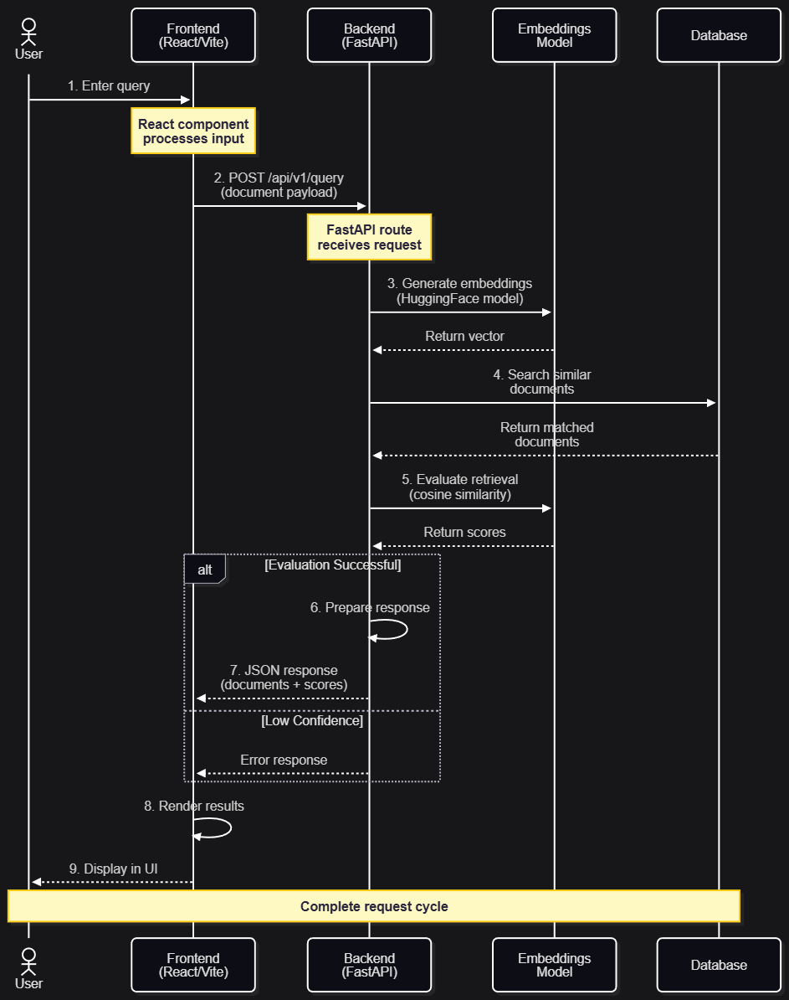

# 📱 Smartphone Review Intelligence — Grounded RAG System

[](https://fastapi.tiangolo.com/)
[](https://reactjs.org/)
[](https://developer.chrome.com/docs/extensions/)
[](https://langchain.com/)
[](https://qdrant.tech/)
[](https://deepmind.google/technologies/gemini/)

**A browser-native multi-source Retrieval-Augmented Generation (RAG) system that automatically captures, ingests, and analyzes smartphone reviews and specs while you browse.**

## 🏗 Architecture



## 🌟 Overview

The Smartphone Review Intelligence system is designed to provide users with grounded, instant, and factual answers about smartphones while browsing e-commerce platforms like Amazon or Flipkart. By injecting a seamless Side Panel UI directly into the browser, it creates an autonomous RAG ingestion pipeline that extracts reviews, dedupes them, semantically chunks the data, and stores it in a vector database for real-time inference.

Unlike generic chatbots, this system is **context-aware**. It detects the smartphone you are currently viewing and retrieves insights specifically grounded in verified reviews, specs, and YouTube transcripts.

## ✨ Key Features

- **Browser-Native Ingestion**: Automatically captures DOM structure and dispatches structured data to the backend via a Chrome Extension.
- **Multi-Source Knowledge Graph**: Aggregates data from Amazon, Flipkart, GSMArena, and YouTube transcripts.
- **Intelligent RAG Pipeline**:
  - Deterministic Identity Normalizer ensures exact product matching.
  - Strict Schema Validation & Deduplication.
  - Semantic chunking with Metadata Enrichment (tags, sentiment, brand).
- **Advanced Retrieval**: Utilizes HuggingFace `sentence-transformers` for dense embeddings and a Qdrant Vector DB, paired with Cross-Encoder Reranking for high-precision retrieval.
- **Grounded Inference**: Leverages Google Gemini / Groq LLMs to provide citation-backed responses and retrieval diagnostics.
- **Frictionless UI**: A React-powered Chrome Side Panel that opens automatically when a product is detected.

## 🛠 Tech Stack

### 🔹 Core AI & Backend (Python)
- **Framework:** FastAPI
- **LLM Orchestration:** LangChain
- **Embeddings:** HuggingFace `sentence-transformers`
- **Vector Database:** Qdrant
- **Inference Models:** Google Gemini / Groq / OpenAI
- **Data Persistence:** SQLite (for robust metadata tracking)

### 🔹 Frontend & Browser Extension (JavaScript / TypeScript)
- **Extension API:** Chrome Manifest V3 (Background Service Workers, Content Scripts, Side Panel API)
- **UI Framework:** React 19 (via Vite)
- **Styling:** Tailwind CSS v4, Lucide React icons

## 🚀 Quick Start Guide

Get the system running locally in **5 minutes**!

### Prerequisites
- **Node.js** (v18+)
- **Python** (v3.10+)
- **Chrome Browser** (v120+)

### 1. Start the Backend API

```bash
cd d:\langchain_model

# Activate your Python virtual environment
venv\Scripts\activate

# Start the FastAPI orchestrator
python -m backend.main
```
✅ Verify: Open http://localhost:8000/docs for the Swagger UI.

### 2. Start the Frontend UI

```bash
cd d:\langchain_model\frontend

# Install dependencies
npm install

# Start the Vite dev server
npm run dev
```
✅ Verify: The chat UI should be accessible at http://localhost:5173.

### 3. Load the Chrome Extension

1. Open Chrome and navigate to `chrome://extensions/`.
2. Enable **Developer mode** (top right corner).
3. Click **Load unpacked**.
4. Select the folder: `d:\langchain_model\extension`.
5. Ensure the extension icon appears in your toolbar.

### 4. Experience the Demo

1. Open a new Chrome tab.
2. Navigate to **Amazon** (e.g., [Search for a phone](https://www.amazon.in/s?k=phone)).
3. Click on any smartphone listing.
4. 🎉 **The AI Side Panel opens automatically!**
5. Ask questions like:
   - *"What are the key specs?"*
   - *"Summarize the camera reviews."*
   - *"What are the pros and cons based on customer feedback?"*

## 📁 Directory Structure

```
d:\langchain_model\
├── backend/                # FastAPI backend & RAG orchestrator
├── frontend/               # React application (Side Panel UI)
├── extension/              # Chrome Extension source code
├── demo/                   # Demo assets and architectural diagrams
├── docs/                   # Documentation
├── tests/                  # Test suites
├── requirements.txt        # Python dependencies
└── README.md               # Project overview
```

## 🔍 Troubleshooting & Documentation

- **Side Panel won't open?** Ensure you're on Chrome v120+ and check the extension's service worker logs.
- **Backend errors?** Confirm Qdrant is accessible and environment variables `.env` are configured properly.
- For detailed setup, troubleshooting, and API reference, see [EXTENSION_SETUP.md](EXTENSION_SETUP.md).

---
*Built with 🩵 for grounded and factual AI interactions.*
